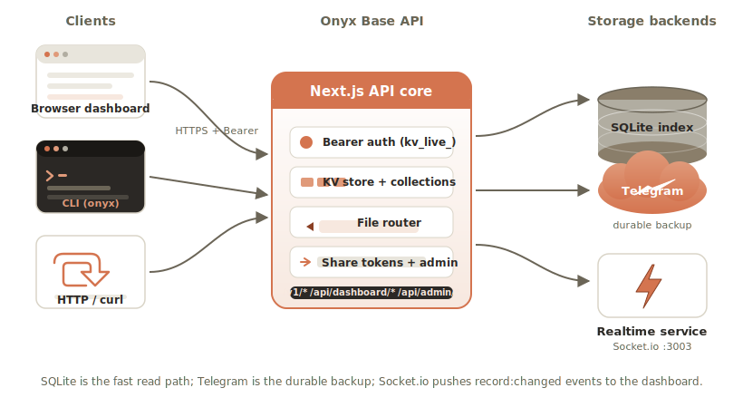
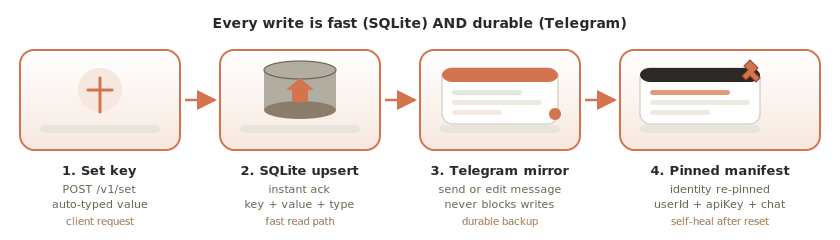
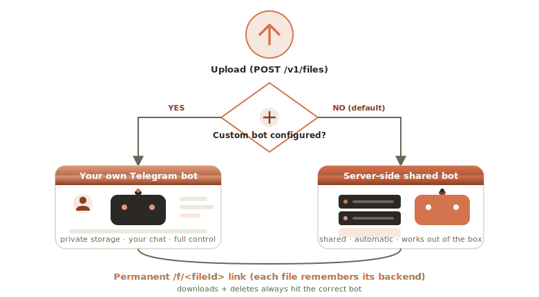
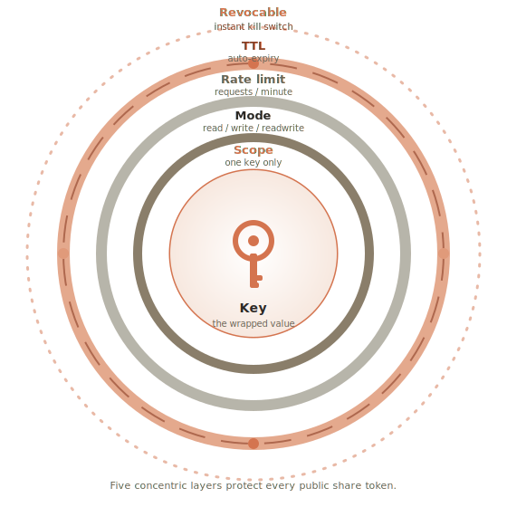
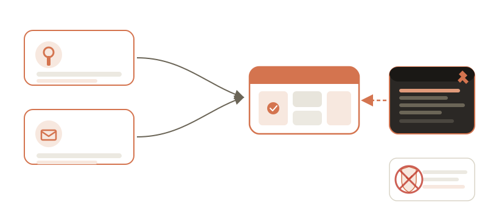
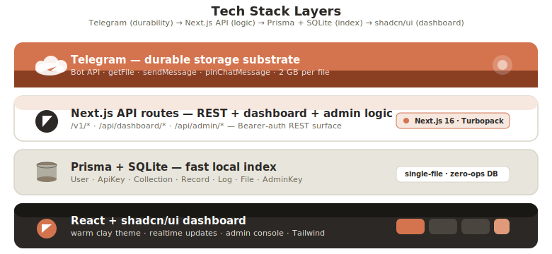
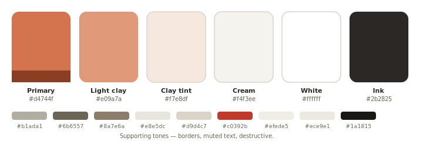

<div align="center">


# Onyx Base

### The key-value & file store that lives in Telegram.

A lightweight Supabase / Firebase–style developer platform. No database to
provision — bring a Telegram Bot Token + Chat ID (or just use the built-in
server-side storage) and you get a fast key-value database **and** a 2 GB-per-file
object store, both backed by Telegram for durability. Ships with a real-time web
dashboard, a REST API, and a zero-dependency CLI.

**Unlimited & free.** Every operation is mirrored into a private Telegram chat,
so your full data and audit log live in Telegram — you can read your database
back from the chat itself.

</div>

<br/>

<!-- ───────────────────────── ARCHITECTURE OVERVIEW ───────────────────────── -->
## Architecture

Onyx Base is a Next.js application that uses Telegram as its durable storage
layer and SQLite as a fast local index. A Socket.io mini-service powers the
real-time dashboard. Clients — browser, CLI, or any HTTP library — talk to a
single REST surface.

<div align="center">

<p align="center"></p>

</div>

*Clients (browser · CLI · HTTP) → Next.js API core → { SQLite index, Telegram
durable storage, Socket.io realtime service }.*

<br/>

<!-- ───────────────────────── FEATURE GRID ───────────────────────── -->
## What's inside

Eight capabilities, one platform. Each lives behind the same API key and the
same Telegram-backed durability model.

<div align="center">

<p align="center"></p>

</div>

| | | |
|:---:|:---:|:---:|
| **Key-value store** — auto-typed values (string / number / boolean / JSON), grouped into collections. | **File storage** — any extension, up to 2 GB per file. Tap **Get link** to mint a signed, 1-hour download URL from Telegram (never auto-refreshed). | **Public share tokens** — scoped, rate-limited, expiring, revocable tokens for embedding in public HTML. |
| **CLI** (`onyx`) — zero-dependency Node.js tool: `set`, `get`, `list`, `export`, `upload`, `download`, `whoami`. | **REST API** — `Authorization: Bearer kv_live_…` on every `/v1/*` route. Cross-origin ready. | **Real-time dashboard** — Socket.io pushes `record:changed` events; the UI updates without polling. |

<br/>

<!-- ───────────────────────── WRITE PATH DATA FLOW ───────────────────────── -->
## How a write flows

Every mutation is fast (SQLite index) **and** durable (Telegram mirror). The
identity manifest is re-pinned so the platform can self-heal after a full reset.

<div align="center">

<p align="center"></p>

</div>

*`set key` → SQLite upsert (fast read path) → Telegram mirror message (durable
backup) → identity manifest re-pinned (self-healing after reset).*

<br/>

<!-- ───────────────────────── STORAGE ROUTING ───────────────────────── -->
## File storage routing

Uploads **automatically** use the server-side Telegram bot when no custom config
is set up. Set up your own bot in Settings to route new uploads to your private
chat. Each file remembers which backend holds it, so downloads and deletes always
hit the correct bot — even if you change config later.

### On-demand download links (Telegram's 1-hour rule)

Telegram revokes every `getFile` download URL after **~1 hour**. Onyx Base
respects that limit instead of fighting it:

- Every file row has a **Get link** button. Tap it → the backend asks Telegram's
  `getFile` API for a fresh **Telegram cloud URL** (`https://api.telegram.org/file/bot…/…`)
  and returns it directly. Telegram revokes this URL after ~1 hour — that's
  Telegram's built-in behaviour, not ours.
- A live countdown shows when the link expires. After expiry, tap **Refresh**
  to pull a brand-new URL from Telegram.
- **Revoke** drops the cached URL from our server immediately and marks the
  file's link as revoked. The next **Get link** call mints a brand-new URL via
  a fresh `getFile` call. (Note: Telegram's own URL remains valid until its
  natural ~1-hour expiry — we can't force Telegram to revoke it sooner — but
  we no longer cache or re-serve it on our side.)
- Links are fetched **only on your tap**, never automatically — so the Telegram
  API is never spammed. A 55-minute server-side cache means even repeated
  calls for the same file make at most one `getFile` call per hour.
- A **proxy URL** on your server's origin (`/f/<fileId>`) is also returned as a
  fallback — permanent for public files, works worldwide, and never exposes
  the Telegram bot token.

<div align="center">

<p align="center"></p>

</div>

*Upload → **full custom config?** → yes: your own Telegram bot · no: the
server-side bot (automatic). Both produce a permanent `/f/<id>` link.*

<br/>

<!-- ───────────────────────── SHARE TOKEN SECURITY ───────────────────────── -->
## Public share tokens — layered security

A share token wraps a single key in five concentric layers of protection, so it
is safe to embed in source-visible platforms (static HTML, CodePen, etc.).

<div align="center">

<p align="center"></p>

</div>

From the inside out: the **key** → **scope** (one key only) → **mode**
(read / write / readwrite) → **rate limit** (requests per minute) → **TTL**
(auto-expiry) → **revocable** (instant kill switch).

<br/>

<!-- ───────────────────────── AUTH & RECOVERY ───────────────────────── -->
## Authentication & recovery

Your API key (`kv_live_…`) is the only credential needed for all data
operations. A separate email + password exists solely for key recovery. Every
identity mutation is mirrored to the Telegram pinned manifest, so the platform
can self-heal after a full reset.

<div align="center">

<p align="center"></p>

</div>

*Sign in via API key **or** email + password → dashboard. Lose your key? Recover
it from the Telegram pinned manifest. Disposable-email signups are blocked at
the door.*

<br/>

<!-- ───────────────────────── TECH STACK LAYERS ───────────────────────── -->
## Tech stack

Four layered concerns, one cohesive warm palette. The outermost layer (Telegram)
is the durable substrate; the innermost (UI) is what you click.

<div align="center">

<p align="center"></p>

</div>

*Telegram (durable storage) → Next.js API routes (logic) → Prisma + SQLite (fast
index) → React + shadcn/ui (dashboard).*

<br/>

<!-- ───────────────────────── QUICK START ───────────────────────── -->
## Quick start

Onyx Base is a cloud-hosted service — once deployed, every developer gets a
public URL. Replace `https://onyx.example.com` below with your instance's URL
(or just use the hosted dashboard in your browser).

```bash
# 1. Install & run the web app (self-host)
bun install
bun run db:push     # create the SQLite schema
bun run dev         # starts on http://localhost:3000 locally

# 2. Create an account (web UI, CLI, or curl) — use your deployed URL in production
curl -X POST https://onyx.example.com/api/auth/register \
  -H "Content-Type: application/json" \
  -d '{"name":"Ada","email":"ada@example.com","password":"secret123"}'
# → { "apiKey": "kv_live_…" }

# 3. Store and read your first value
curl -X POST https://onyx.example.com/v1/kv/default/visits \
  -H "Authorization: Bearer kv_live_…" \
  -H "Content-Type: application/json" \
  -d '{"value": 0}'

curl https://onyx.example.com/v1/kv/default/visits \
  -H "Authorization: Bearer kv_live_…"
# → { "value": 0, "type": "number" }

# 4. Upload a file (any extension, up to 2 GB) — auto-routed to server-side Telegram
curl -X POST https://onyx.example.com/v1/files \
  -H "Authorization: Bearer kv_live_…" \
  -F "file=@./report.pdf"
# → { "file": { "id": "…", "fileId": "f_…", "storageMode": "server", "isPublic": true } }

# 5. Mint a fresh Telegram cloud download link (revoked by Telegram after ~1h)
curl -X POST https://onyx.example.com/api/files/<id>/link \
  -H "Authorization: Bearer kv_live_…"
# → { "url": "https://api.telegram.org/file/bot…/…",   ← raw Telegram cloud URL
#     "proxyUrl": "https://onyx.example.com/f/f_…",     ← permanent proxy fallback
#     "expiresAt": 1735900000000, "expiresInSec": 3300, "revocable": true }

# 6. Download the file — the Telegram URL works from anywhere for ~1 hour
curl -L "https://api.telegram.org/file/bot…/…" -o report.pdf

# Revoke the cached link (drops our cache; the next /link call mints a new URL):
curl -X POST https://onyx.example.com/api/files/<id>/revoke \
  -H "Authorization: Bearer kv_live_…"

# After the link expires, mint a new one (add ?force=1 to bypass the cache):
curl -X POST "https://onyx.example.com/api/files/<id>/link?force=1" \
  -H "Authorization: Bearer kv_live_…"
```

> Download links are **Telegram's raw cloud URLs** (`api.telegram.org/file/…`),
> valid for ~1 hour (Telegram's built-in revocation). The server caches each
> URL for 55 minutes so repeated calls make at most one `getFile` call per hour —
> Telegram is never spammed. Mint a new link after expiry. **Revoke** drops our
> cache immediately; the next Get link call pulls a brand-new URL from Telegram.
> A permanent proxy URL (`/f/<fileId>`) is also returned for public files.

### CLI

```bash
npm i -g onyx-base
export ONYX_URL=https://onyx.example.com

onyx login --name "Ada" --email ada@example.com
onyx set visits 0
onyx get visits
onyx upload ./report.pdf --label "Q3 report"
onyx files
onyx download f_abc123 ./out.pdf
```

<br/>

<!-- ───────────────────────── API SURFACE ───────────────────────── -->
## API surface

Every route below (except `signup` / `share` / `recover` / `f/[id]`) requires:

```
Authorization: Bearer kv_live_…
```

| Method | Path | Purpose |
|:---|:---|:---|
| `POST` | `/api/auth/register` | Create account → returns API key |
| `POST` | `/api/auth/login` | Email + password recovery login |
| `POST` | `/api/auth/recover` | Restore keys from a Telegram manifest paste |
| `GET` | `/v1/kv/:collection/:key` | Read a value |
| `POST` | `/v1/kv/:collection/:key` | Set / upsert a value (auto-typed) |
| `DELETE` | `/v1/kv/:collection/:key` | Delete a value |
| `GET` | `/v1/kv/:collection` | List keys in a collection |
| `GET` | `/v1/export` | Dump the whole database as JSON |
| `POST` | `/v1/files` | Upload a file (multipart) → file metadata |
| `GET` | `/v1/files` | List stored files |
| `GET` | `/v1/files/:id` | File metadata |
| `DELETE` | `/v1/files/:id` | Permanently delete a file |
| `POST` | `/api/files/:id/link` | Mint a Telegram cloud URL (cached ~55 min; `?force=1` to bypass) |
| `POST` | `/api/files/:id/revoke` | Drop the cached Telegram URL + mark the link revoked |
| `POST` | `/v1/files/:id/link` | REST equivalent — mint a Telegram cloud URL |
| `POST` | `/v1/files/:id/revoke` | REST equivalent — revoke the cached link |
| `GET` | `/f/:fileId` | Public download proxy (no auth) — streams bytes from Telegram |
| `GET` | `/v1/whoami` | Identify the current API key + user |
| `GET` | `/v1/stats` | Account statistics (records, files, activity, …) |
| `GET` | `/v1/logs` | Recent audit log entries (`?limit=50&action=…`) |
| `GET` | `/v1/health` | Service + Telegram storage status |
| `GET` | `/v1/collections` | List collections (with record counts) |
| `POST` | `/v1/collections` | Create a collection (body: `{"name":"cache"}`) |
| `DELETE` | `/v1/collections/:name` | Delete a collection + all its records |
| `GET` | `/v1/share/:token` | **Public** scoped read (no auth) |
| `POST` | `/v1/write/:token` | **Public** scoped write (incr / set / append) |
| `POST` | `/api/dashboard/share-tokens` | Create a scoped share token |
| `GET` | `/api/dashboard/share-tokens` | List your share tokens |
| `DELETE` | `/api/dashboard/share-tokens/:id` | Revoke a share token |
| `GET` | `/api/dashboard/collections` | List collections (dashboard) |
| `POST` | `/api/dashboard/collections` | Create a collection (dashboard) |
| `DELETE` | `/api/dashboard/collections/:name` | Delete a collection (dashboard) |

<br/>

<!-- ───────────────────────── DESIGN SYSTEM ───────────────────────── -->
## Design system

The dashboard uses a Claude-inspired warm palette — paper-like cream surfaces,
clay accents, and warm ink text. Light theme by default; a dark variant is
available via `.dark`.

<div align="center">

<p align="center"></p>

</div>

| Token | Hex | Role |
|:---|:---|:---|
| `--primary` | `#d4744f` | Clay — brand accent, primary buttons, active state |
| `--chart-2` | `#e09a7a` | Light clay — secondary accents, gradients |
| `--accent` | `#f7e8df` | Clay tint — subtle fills, info banners |
| `--background` | `#f4f3ee` | Cream — page background |
| `--card` | `#ffffff` | White — cards, popovers |
| `--foreground` | `#2b2825` | Warm ink — headings, body |
| `--muted-stone` | `#b1ada1` | Muted stone — borders, dividers |
| `--muted-foreground` | `#6b6557` | Muted text — secondary copy |
| `--border` | `#d9d4c7` | Hairline borders |
| `--destructive` | `#c0392b` | Destructive actions |

<br/>

<!-- ───────────────────────── PROJECT LAYOUT ───────────────────────── -->
## Project layout

```
src/
├── app/
│   ├── api/            # dashboard API routes (auth, files, share-tokens, …)
│   ├── v1/             # public REST API (kv, files, share, write)
│   ├── f/[id]/         # public file download proxy
│   └── page.tsx        # the single user-visible route
├── components/
│   ├── dashboard/      # storage, share, docs, playground, settings, …
│   └── ui/             # shadcn/ui component set
├── lib/
│   ├── data-store.ts   # the in-memory + disk store, Telegram sync, file CRUD
│   ├── telegram.ts     # sendKvMessage, sendDocumentFile, pinned manifest…
│   ├── auth.ts         # Bearer auth + getPublicOrigin + auto-rehydrate
│   ├── kv.ts           # ensureCollection, setKey, getKey, logAction…
│   └── api.ts          # typed client used by the dashboard
mini-services/
└── realtime/           # Socket.io service (port 3003) — record:changed events
cli/
└── index.js            # the zero-dependency `onyx` CLI
prisma/
└── schema.prisma       # User, ApiKey, Collection, Record, Log…
```

<br/>

<!-- ───────────────────────── TELEGRAM SETUP ───────────────────────── -->
## Telegram setup

The platform works out of the box using the server-side Telegram bot. To route
storage to your **own** private chat instead:

1. Create a bot via [@BotFather](https://t.me/BotFather) → copy the **Bot Token**.
2. Create a channel or group, add the bot as an **administrator**.
3. Forward any message from that chat to [@userinfobot](https://t.me/userinfobot) to get the **Chat ID** (it looks like `-1001234567890`).
4. In the dashboard → **Settings → Storage backend**, paste the Chat ID and Bot Token, and save.

From that point, new uploads and KV mirrors go to **your** bot. Existing files
stay on whichever backend they were uploaded to (each file remembers), so
downloads and deletes keep working.

> The cloud Telegram Bot API caps bot uploads at ~50 MB and `getFile` downloads
> at ~20 MB. The full 2 GB envelope is unlocked by running a
> [local Bot API server](https://github.com/tdlib/telegram-bot-api). The 2 GB
> ceiling is enforced app-side either way.

<br/>

<!-- ───────────────────────── LICENSE ───────────────────────── -->
## License

MIT — build on it, ship it, make it yours.

<div align="center">

<sub>Built with Next.js 16 · Prisma · Socket.io · Telegram · shadcn/ui</sub>
<br/>
<sub>Palette: Claude-inspired warm clay on cream.</sub>

</div>
